# WIrtualne Studia

## O naszej grze

> 🖥️ AGH promotional game hackathon.

WIrtualne Studia są immersywną grą pozwalającą doświadczyć studiów na Wydziale Informatyki. Zagłębij się w świat studenta informatyki: uczęszczaj na zajęcia, rozwiązuj zadania, zdobywaj punkty ECTS i ukończ studia. :robot:

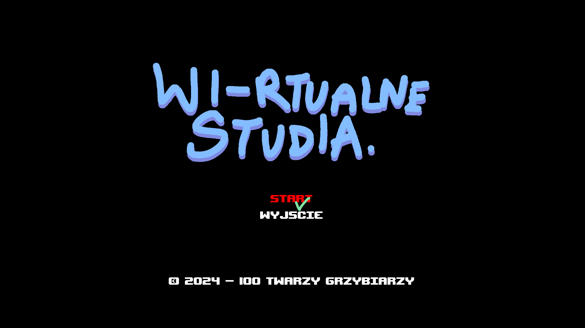


## Świat D17

Jako gracz, znajdziesz się w budynku Wydziału Informatyki na kampusie AGH. Eksploruj korytarze budynku D17. Znajdziesz w nich pracowników, sale zajęć oraz pewne sekrety...

### Przedmioty

Weź udział w zajęciach z matematyki, programowania algorytmiki oraz techniki cyfrowej. Poznasz na nich podstawy tych dyscyplin i dowiesz się jak przebiegają na rzeczywistych studiach.

### Zadania

Prowadzący przedmiotów zlecą ci rozmaite zadania. Sposób w jaki je wykonasz wpłynie na końcową ocenę twoich studiów.

## Koncepcje

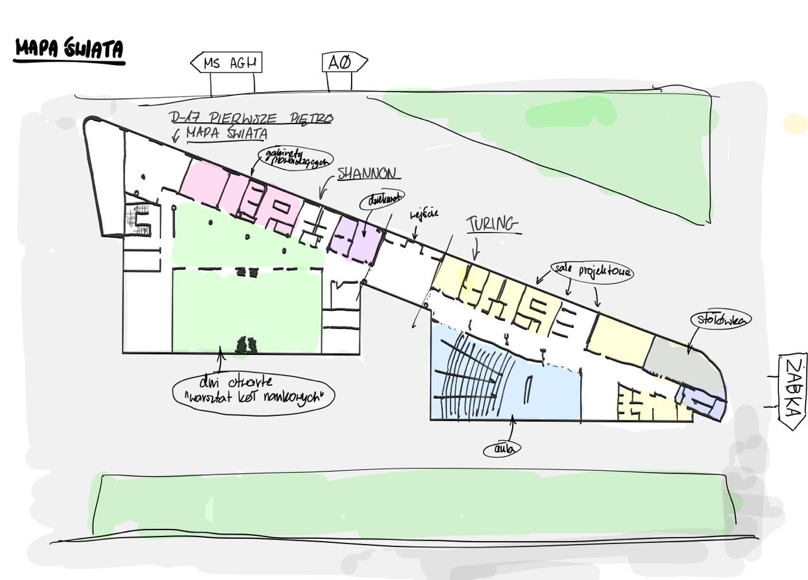

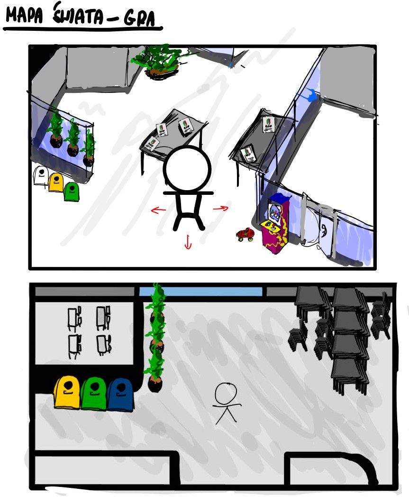

## Makiety

### Korytarze - mapa

Studenci mają możliwość chodzenia i eksplorowania korytarzy budynku D17. Można wejść do wielu sal, np. z minigrami lub poszukać ukrytych ciekawostek.

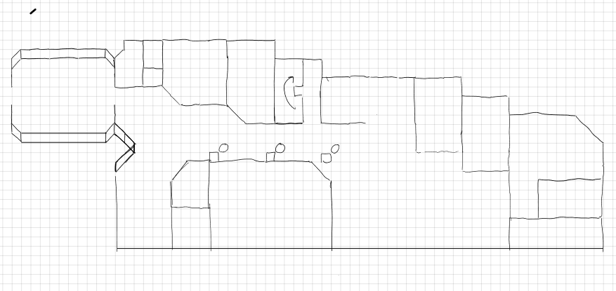

### Gra Matematyka

Gra polega na przejściu kursu matematycznego. Po skończeniu dwóch laboratoriów, studenci będzą przystępować do kolokwium.

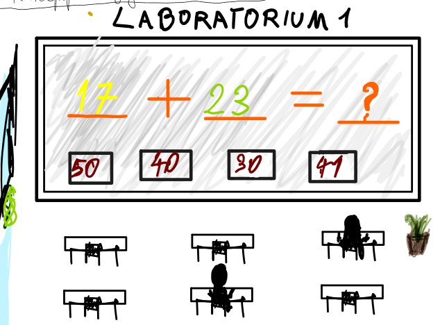

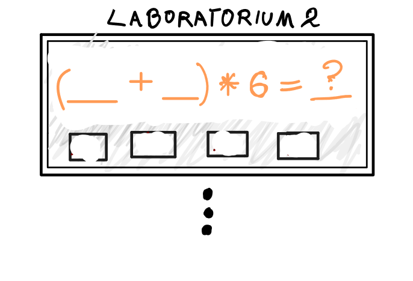

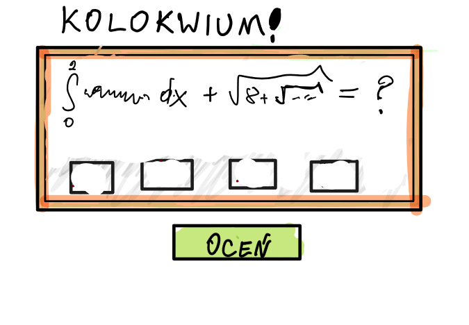

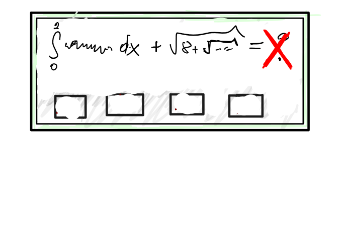

### Gra Cyfrówka

Gra polega na poprawnym ułożeniu bramek logicznych, tak aby końcowy wynik był wartością pozytywną. W efekcie lampka zapala się na zielono.

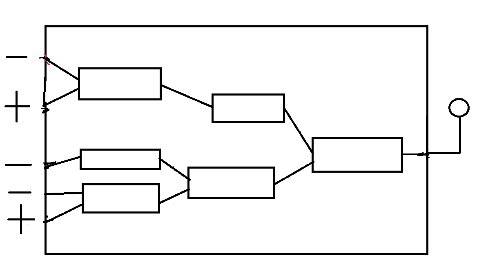

### Easter eggs

Na planszy gry będzie można znaleźć wiele ciekawostek. Poniżej są nasze pomysły na niektóre z nich.

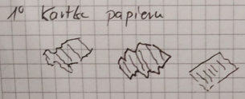

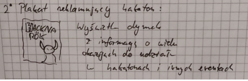

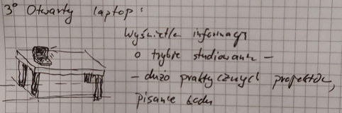

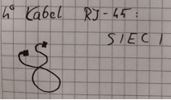

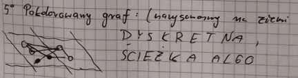

## Środowisko deweloperskie

1. Python version: `3.10`,
2. Initializing virtual Python environment:
    ```
    $ virtualenv env
    $ source ./env/bin/activate
    ``` 
3. Installing devlopment dependencies:
   ```
   $ pip install -r requirements.txt
   ```
4. Uruchomienie
   ```
   $ python3 -m hackathon
   ```

## Autorzy

#### 100 Twarzy Grzybiarzy
* Natalia Adamiak
* Jan Augustyn
* Szymon Bednorz
* Jakub Kasperski
* Edyta Rozczypała
* Jan Smółka
